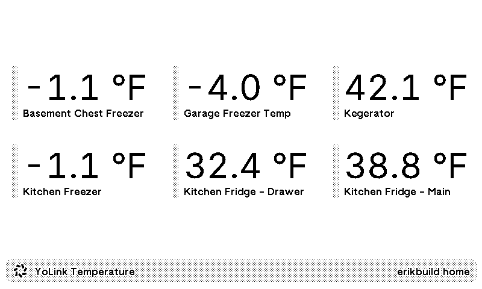

# YoLink Temperature Sensor Plugin for TRMNL

This [TRMNL](https://usetrmnl.com/) plugin displays a grid of all of your temperature/humidity sensors from a YoLink account.  

NOTE: It requires hosting a simple json proxy api on something like Cloudflare Worker, Netlify Function, or AWS Lambda to proxy the API requests.

## Prerequisites

### Get YoLink UserID / Secrets
Generate a User Access Credential in the YoLink app if you haven't already.
1. Open YoLink App
1. Click the hamburger icon in the top left.
1. Click Settings > Account > Advanced Settings > User Access Credentials
1. Create a new credential if you don't already have one.  Otherwise, copy the *UIAD* and *Secret Key*.

### Create Cloudflare Worker
1. Create (or sign in to) a CloudFlare personal (free) account.
1. Navigate to *Computer (Workers) > Workers & Pages*.
1. Click on *Create* and then *Hello World > Get Started*.
1. Name the worker and Click *Deploy*.  Note the deploy URL.
1. Click *Edit Code* and replace the contents of `worker.js` in CloudFlare with the contents of `cloudflare\worker.js` from this repository.
1. Click *Deploy* to deploy the worker.
1. Click back to the worker overview page and Click *Settings*.
1. Click *Variables & Secrets*.
    1. Add a Secret named `YOLINK_CLIENT_ID` and set the value to the UIAD from your YoLink account.
    1. Add a Secret named `YOLINK_CLIENT_SECRET` and set the value to the Secret Key from your YoLink account.
1. Visit your deploy URL; you should see a JSON result with your temperature values and devices.

### Import the Plugin into TRMNL Dashboard
1. Download the [latest release](https://github.com/erikbuild/trmnl-yolink-temperature/releases) zip.
1. Visit the [TMRNL Private Plugin Page](https://usetrmnl.com/plugin_settings?keyname=private_plugin).
1. Click *Import new* and select the latest release zip.
1. Set your Cloudflare Worker URL as well as the Subtitle Text.

## Local Development

Either the `trmnl_preview` gem or Docker must be installed.

Simply clone the repo, then run `bin/dev`.

## References
- http://doc.yosmart.com/docs/yolinkapi/THSensor
- http://doc.yosmart.com/docs/protocol/datapacket#BUDP
- http://doc.yosmart.com/docs/account/Manage#5manageretrieveyolinkdevice